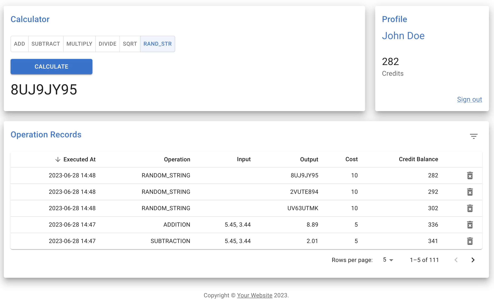
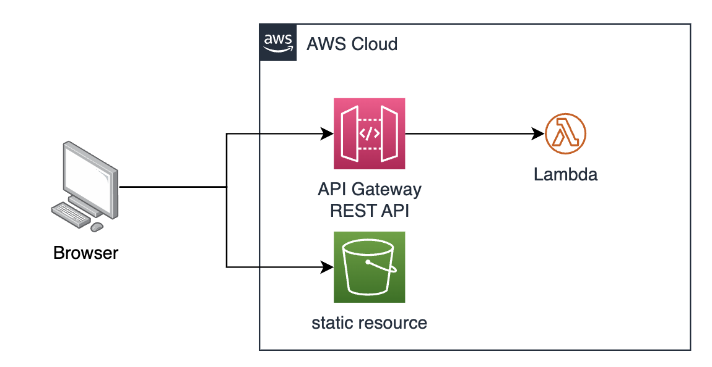

# Serverless Calculator UI

Demonstrates the usage of the [serverless framework](https://www.serverless.com/) to build a SPA application with SSR support in a serverless cloud environment.

## Environment setup

Needs Node 18.5. If you use [NVM](https://github.com/nvm-sh/nvm/blob/master/README.md) to manage your node version, on the project root folder run:

`nvm use`

## Running locally

You can run the serverless framework locally and simulate AWS resources like the API Gateway and the Lambda functions.

`npm start`

You will see the local endpoint URLs in the terminal.

## Running tests

`npm test`

These are some of the libraries we use for tests:

- Jest
- nock. To mock/assert HTTP interactions.

## Deploy to cloud

To deploy the project on your own AWS account, you need to follow the instructions on the serverless [documentation](https://www.serverless.com/framework/docs/guides/parameters#creating-serverless-dashboard-parameters) and then run the following:

`npm run deploy`

Be aware that you must set up the `BACKEND_URL` parameter as described in serverless documentation to complete this step successfully.

After a successful deployment, you will see the public endpoint URLs in the terminal.

## Architecture

Users request the SPA application and hit the API Gateway, which will forward the request to the Lambda function.

The lambda function generates a static version of the SPA application and returns the generated HTML to the user.

Finally, the static HTML will load external resources (javascript, CSS, images, etc.) from an s3 bucket.

### TODOs (Architecture)

One improvement would be to add a CDN and push the s3 content into there; this will reduce the response time when requesting static content.

Another thing we should add for a production application is a WAF (web application firewall) to increase security and availability; this would sit in front of the API Gateway.

## Development

The application is built around these building blocks:

- **Presentational components**: Visible components that display data and allow interactions.
- **Container components**: These containers can group more than one presentational component; it takes care of the business logic and communication between different state stores and external systems.
- **State stores**: Central state management implemented through [Zustand](https://zustand-demo.pmnd.rs/) provides a simplified and full-featured central state management store alternative.
- **Clients**: Manages communications with external systems.

### Decisions

Opted for the Serverless framework as it provides code and serverless-centric infrastructure management in one place.

I also picked Zustand for state management in React as it has a straightforward and clean API over other alternatives.

### Best Practices

- SOLID
- Hexagonal architecture
- TDD

### TODOs (Development)

- add missing tests (I just added unit tests for the more relevant components)
- integration and e2e tests
- enable tests coverage report and see the numbers
